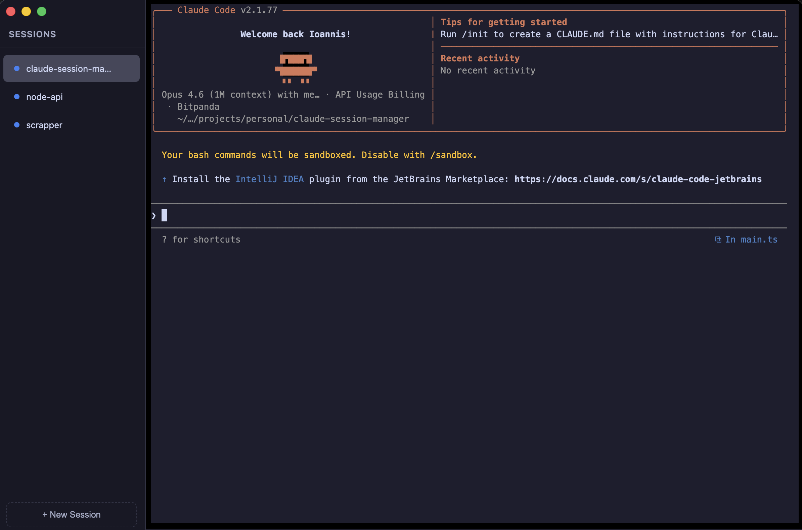

# Claude Session Manager

A desktop app for managing multiple [Claude Code](https://docs.anthropic.com/en/docs/claude-code) CLI sessions side by side.



## Features

- Run multiple Claude Code sessions in parallel, each in its own project directory
- Sidebar with live session status indicators:
  - **Green (pulsing)** — Claude is working
  - **Blue** — idle, waiting for input
  - **Yellow** — needs confirmation (y/n, permissions, etc.)
  - **Red** — session exited
- Native macOS notifications when a background session finishes or needs input
- Full terminal emulation via xterm.js
- Keyboard shortcuts for fast navigation
- Path validation to prevent opening broad directories (`/`, `~`, etc.)

## Requirements

- macOS (tested on Apple Silicon)
- [Node.js](https://nodejs.org/) >= 18
- [Claude Code CLI](https://docs.anthropic.com/en/docs/claude-code) installed and available in your `PATH`

## Getting Started

```bash
# Clone the repo
git clone https://github.com/your-username/claude-session-manager.git
cd claude-session-manager

# Install dependencies
npm install

# Build and run
npm start
```

## Keyboard Shortcuts

| Shortcut | Action |
|---|---|
| `Cmd+N` | Create a new session |
| `Cmd+ArrowUp` | Switch to previous session |
| `Cmd+ArrowDown` | Switch to next session |

## Development

```bash
# Watch mode (recompile on changes)
npm run watch

# Then in another terminal, run the app
electron .
```

## Minimal Dependencies

This project intentionally keeps its dependency tree small to reduce the supply chain attack surface. The only runtime dependencies are:

| Package | Purpose |
|---|---|
| `electron` | Application shell |
| `node-pty` | PTY spawning for Claude CLI processes |
| `@xterm/xterm` | Terminal emulation in the renderer |
| `@xterm/addon-fit` | Responsive terminal sizing |

No bundlers, no CSS frameworks, no utility libraries. The renderer loads plain scripts without a build pipeline beyond TypeScript compilation. Fewer dependencies means fewer vectors for compromised packages to reach your system — especially important for an app that spawns shell processes with full filesystem access.

## How It Works

Each session spawns a real `claude` CLI process in a pseudo-terminal (via `node-pty`). The app monitors terminal output to detect Claude's state (working, idle, needs input) by parsing prompt patterns after ANSI stripping. This means IDE integrations like the IntelliJ plugin work transparently — they see the same CLI process they would in a regular terminal.

## License

ISC